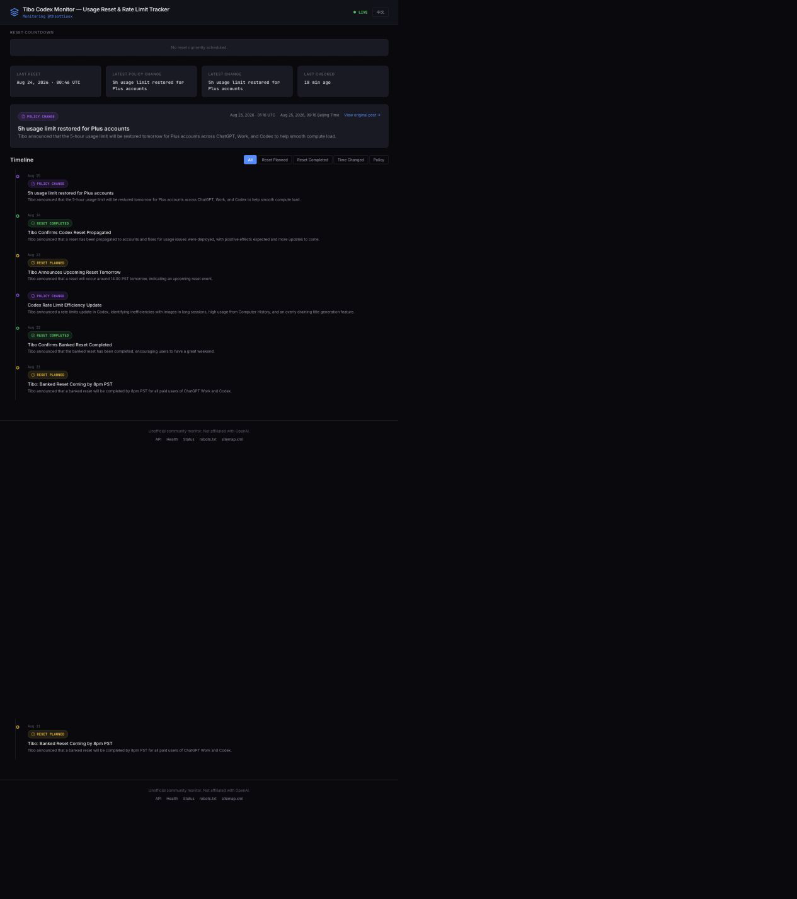
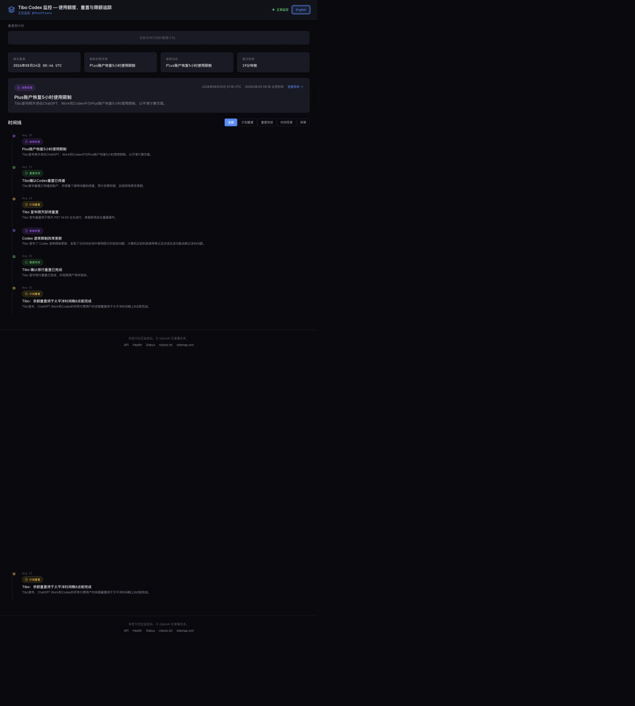

# Tibo Codex Monitor — Codex Usage Limit Reset & Rate-Limit Tracker

**[Open the live monitor →](https://tibo.modelyard.dev/)** · [中文介绍](README.zh-CN.md) · [中文界面](https://tibo.modelyard.dev/zh/) · [Latest events](https://tibo.modelyard.dev/latest/) · [Reset history](https://tibo.modelyard.dev/reset-history/) · [Rate-limit updates](https://tibo.modelyard.dev/rate-limit-updates/)

Tibo Codex Monitor is an unofficial community dashboard for public updates from [Tibo (@thsottiaux)](https://x.com/thsottiaux) about Codex usage limit resets, rate limits, ChatGPT Work usage, and subscription changes.

It turns those updates into a timestamped reset history and rate-limit tracker. Each event includes its source and verification status, helping visitors distinguish direct X API evidence from indexed reports. It is independent and not affiliated with OpenAI.

## Why this project

Codex reset announcements are often short public posts and can be easy to miss. This project collects the relevant signals in one bilingual monitor without accessing user accounts or changing usage limits.

## What it includes

- Bilingual English and Simplified Chinese Codex monitor pages
- English dates in New York time and Chinese dates in Beijing time
- Codex usage reset history with reset, time-change, and policy-update categories
- Source and verification labels for each event
- Automatic source monitoring with Cloudflare Workers and D1
- Public pages for the [Codex monitor](https://tibo.modelyard.dev/), [events API](https://tibo.modelyard.dev/api/events), and [health status](https://tibo.modelyard.dev/api/health)
- A lightweight anonymous [ModelYard Community](https://tibo.modelyard.dev/community/) feed with cached English, Chinese, Japanese, Spanish, and French translations and server-validated GitHub repository cards
- An isolated Open Gambit V1 column at [/open-gambit/](https://tibo.modelyard.dev/open-gambit/) for source-grounded AI, software, product, company, and ecosystem strategy analysis; it is politically excluded, clearly labels facts/analysis/AI forecasts, and requires human approval before publication

## Screenshots





## Run locally

```bash
npm install
cp .dev.vars.example .dev.vars
cp wrangler.example.jsonc wrangler.jsonc
npm run db:migrate:local
npm run open-gambit:demo
npm run provenance
npm run dev
```

The example variables and Wrangler configurations are placeholders. Open Gambit scheduling is disabled by default in local/staging examples; its local demo uses fictional `TEST_ONLY` fixtures and no network or LLM credentials. Add real credentials only to the local `.dev.vars` file or to Cloudflare Worker secrets; never commit them.

The additive Open Gambit migration is `migrations/0021_open_gambit.sql`. `npm run migration:parity` creates a fresh local D1 database, applies the complete chain, checks the Gambit tables/indexes and foreign keys, and removes its temporary state. The `/api/health` response includes non-secret build, schema, prompt, and disclosure provenance.

## ModelYard Community

Community is implemented inside the existing Hono Worker and D1 migration chain. Posts keep `original_content` as the source of truth; translations and GitHub metadata are derived, cached records. Public pages read approved posts with cursor pagination, while the moderation console is at `/admin/community/` and requires the server-side `COMMUNITY_ADMIN_TOKEN` as a Bearer token. `COMMUNITY_TRANSLATION_LOCALES` controls the write-once translation targets and defaults to `en,zh,ja,es,fr`.

Posting is fail-closed until Turnstile site/secret keys and `ABUSE_HASH_SECRET` are configured. The Worker retains an HMAC source hash for abuse controls and rate limiting, not the raw request IP. Role-like nicknames such as `admin`, `moderator`, and `official` are reserved; only the authenticated admin console can publish official announcements. Those posts use the server-issued `admin` identity, an announcement label, and a verified badge. The Community page advises visitors not to post credentials or other sensitive personal information.

## Verify locally; deploy only after review

```bash
npm test
npm run lint
npm run build
npm run migration:parity
npm run open-gambit:demo
```

Deployment is a separate, explicitly authorized release action and is not part of local verification. It requires a reviewed staging configuration, a separate staging D1/R2/Workflow namespace, migration review, and a rollback plan. The production Wrangler configuration is kept outside the repository; use `wrangler.example.jsonc` or `wrangler.staging.example.jsonc` as starting points. This repository's Open Gambit implementation work does not deploy or mutate production resources.

## Security

Please do not post API keys, access tokens, bot tokens, database credentials, or private configuration in issues or pull requests. See [SECURITY.md](SECURITY.md) for the reporting policy.

## License

No license has been added yet. Contact the project owner before reusing the source in another product.
